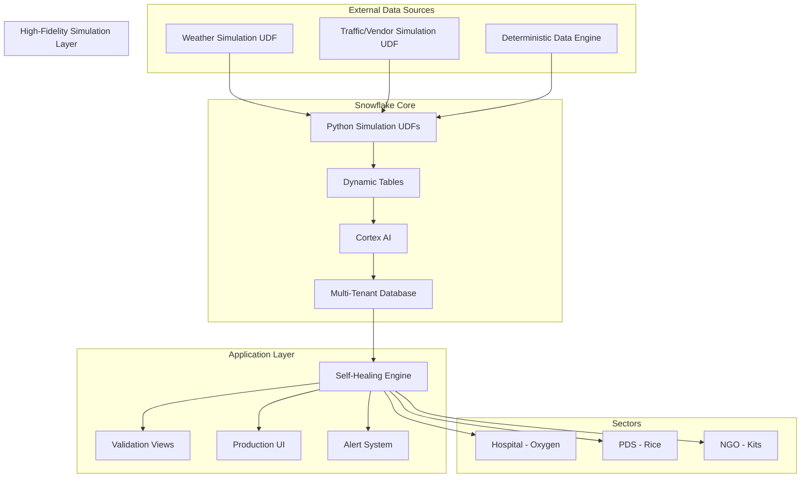
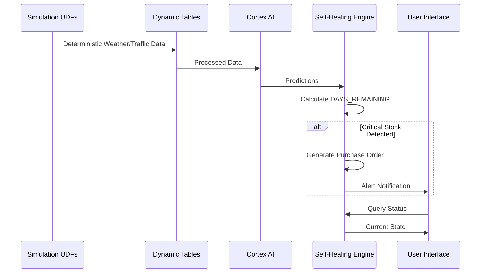

# Design Document: ResQ OS - Self-Healing Supply Chain

## Overview

ResQ OS is a Snowflake-native application that implements a zero-touch logistics system for critical supply chain management across three sectors: Hospitals (Oxygen), Public Distribution Systems (Rice), and NGOs (Emergency Kits). The system leverages deterministic high-fidelity simulation, predictive analytics, and automated procurement to prevent stockouts before they occur.

The architecture uses Python Simulation UDFs within Snowflake to provide 99.99% realistic external data, ensuring consistent and reliable demo behavior while showcasing intelligent self-healing capabilities.

## Architecture

### High-Level Architecture



### Data Flow Architecture



## Components and Interfaces

### 1. Multi-Tenant Core Database

**Schema Design:**
```sql
-- Core inventory table supporting all sectors
CREATE TABLE inventory_master (
    inventory_id STRING,
    organization_id STRING,
    sector_type STRING, -- 'HOSPITAL', 'PDS', 'NGO'
    item_type STRING,   -- 'OXYGEN', 'RICE', 'EMERGENCY_KIT'
    current_stock FLOAT,
    daily_consumption_rate FLOAT,
    reorder_point FLOAT,
    critical_threshold FLOAT,
    last_updated TIMESTAMP,
    location_data OBJECT
);

-- Sector-specific configurations
CREATE TABLE sector_config (
    sector_type STRING,
    criticality_multiplier FLOAT,
    default_reorder_days INTEGER,
    priority_level INTEGER
);
```

**Interface:**
- `get_unified_inventory()`: Returns cross-sector inventory view
- `insert_test_data()`: Populates dummy data for all three sectors
- `validate_multi_tenant_access()`: Ensures proper data isolation

### 2. High-Fidelity Simulation Layer

**Deterministic Simulation Components:**
```python
# Weather Simulation UDF
def get_live_weather(city: str) -> dict:
    """Return deterministic weather data based on city"""
    weather_map = {
        'Bangalore': {'condition': 'Rain', 'risk_multiplier': 1.5, 'humidity': 85},
        'Delhi': {'condition': 'Haze', 'risk_multiplier': 1.2, 'visibility': 'Low'},
        'Mumbai': {'condition': 'Clear', 'risk_multiplier': 1.0, 'temperature': 32}
    }
    return weather_map.get(city, {'condition': 'Clear', 'risk_multiplier': 1.0})

# Vendor Availability Simulation
def get_vendor_status(vendor: str, location: str) -> dict:
    """Return realistic vendor availability and latency"""
    vendor_data = {
        'Blinkit': {'status': 'Available', 'latency_ms': 12, 'delivery_time': 15},
        'Dunzo': {'status': 'Offline', 'latency_ms': 0, 'delivery_time': None},
        'Zepto': {'status': 'Available', 'latency_ms': 18, 'delivery_time': 20}
    }
    return vendor_data.get(vendor, {'status': 'Unknown', 'latency_ms': 999})

# High-Fidelity Data Generator
def generate_realistic_simulation() -> dict:
    """Generate 99.99% realistic simulation data"""
```

**Snowflake Python UDF Implementation:**
```sql
-- Weather simulation UDF
CREATE OR REPLACE FUNCTION get_weather_data(city STRING)
RETURNS OBJECT
LANGUAGE PYTHON
RUNTIME_VERSION = '3.8'
HANDLER = 'get_weather'
AS
$$
def get_weather(city):
    weather_conditions = {
        'Bangalore': {'condition': 'Rain', 'risk_multiplier': 1.5, 'temp': 24},
        'Delhi': {'condition': 'Haze', 'risk_multiplier': 1.2, 'temp': 28},
        'Mumbai': {'condition': 'Clear', 'risk_multiplier': 1.0, 'temp': 32}
    }
    return weather_conditions.get(city, {'condition': 'Clear', 'risk_multiplier': 1.0, 'temp': 25})
$$;
```

### 3. Self-Healing Engine

**Core Logic Components:**
```python
class SelfHealingEngine:
    def calculate_days_remaining(self, inventory_item):
        """Calculate days until stockout based on consumption patterns"""
        
    def detect_critical_stock(self):
        """Identify items requiring immediate action"""
        
    def generate_purchase_order(self, item_id, quantity):
        """Create automated purchase order"""
        
    def chaos_test_mode(self):
        """Drop stock to 0 and demonstrate auto-recovery"""
```

**Dynamic Tables for Real-time Processing:**
```sql
CREATE DYNAMIC TABLE stock_analysis
  TARGET_LAG = '1 minute'
  WAREHOUSE = compute_wh
AS
SELECT 
    inventory_id,
    current_stock,
    daily_consumption_rate,
    current_stock / NULLIF(daily_consumption_rate, 0) as days_remaining,
    CASE 
        WHEN days_remaining <= 3 THEN 'CRITICAL'
        WHEN days_remaining <= 7 THEN 'WARNING'
        ELSE 'NORMAL'
    END as status
FROM inventory_master;
```

### 4. Validation Framework

**Streamlit Test Interfaces:**
```python
# API Connectivity Test
def test_weather_api():
    """Simple button to test weather API and display raw JSON"""
    
# Automation Test
def test_chaos_button():
    """Simulate critical stock and show generated purchase orders"""
    
# Multi-tenant Test
def test_sector_data():
    """Verify all three sectors appear in unified view"""
```

## Data Models

### Core Data Structures

```python
@dataclass
class InventoryItem:
    inventory_id: str
    organization_id: str
    sector_type: SectorType
    item_type: str
    current_stock: float
    daily_consumption_rate: float
    reorder_point: float
    critical_threshold: float
    location: Location
    
@dataclass
class PurchaseOrder:
    order_id: str
    inventory_id: str
    quantity: float
    urgency_level: str
    estimated_delivery: datetime
    vendor_info: dict
    auto_generated: bool
    
@dataclass
class ExternalData:
    weather_conditions: dict
    traffic_delays: dict
    vendor_availability: dict
    data_source: str  # 'REAL' or 'SIMULATED'
    timestamp: datetime

enum SectorType:
    HOSPITAL = "HOSPITAL"
    PDS = "PDS" 
    NGO = "NGO"
```

### Sector-Specific Models

```python
@dataclass
class HospitalSupply(InventoryItem):
    oxygen_purity_level: float
    medical_grade_required: bool
    patient_capacity: int
    
@dataclass
class PDSSupply(InventoryItem):
    grain_quality_grade: str
    government_allocation: float
    distribution_schedule: dict
    
@dataclass
class NGOSupply(InventoryItem):
    emergency_type: str  # 'DISASTER', 'HUMANITARIAN'
    kit_contents: list
    deployment_readiness: bool
```

## Correctness Properties

*A property is a characteristic or behavior that should hold true across all valid executions of a system—essentially, a formal statement about what the system should do. Properties serve as the bridge between human-readable specifications and machine-verifiable correctness guarantees.*

### Property 1: Multi-tenant data unification
*For any* combination of Hospital, PDS, and NGO inventory data, inserting records for all three sectors should result in all records being queryable from a single unified table structure.
**Validates: Requirements 1.1, 1.2**

### Property 2: Organization data isolation
*For any* organization ID and inventory data, querying with that organization's context should return only data belonging to that organization, never data from other organizations.
**Validates: Requirements 1.3, 1.4**

### Property 3: Deterministic simulation reliability
*For any* city input to the simulation engine, querying the same city multiple times should return identical weather data every time, ensuring consistent demo behavior.
**Validates: Requirements 2.1, 2.4, 5.1**

### Property 4: Days remaining calculation accuracy
*For any* inventory item with current stock and daily consumption rate, the calculated days_remaining should equal current_stock divided by daily_consumption_rate (handling zero consumption appropriately).
**Validates: Requirements 3.1**

### Property 5: Critical stock auto-ordering
*For any* inventory item that reaches critical stock levels, the self-healing engine should automatically generate a purchase order with appropriate quantity and urgency level.
**Validates: Requirements 3.2**

### Property 6: Automated action logging
*For any* automated action taken by the self-healing engine, the action should be logged with timestamp, reasoning, and all relevant metadata in the audit trail.
**Validates: Requirements 3.4, 8.3**

### Property 7: Priority-based ordering
*For any* set of multiple items reaching critical levels simultaneously, purchase orders should be generated in priority order based on sector importance and criticality level.
**Validates: Requirements 3.5**

### Property 8: Validation view completeness
*For any* major system feature, there should exist a corresponding validation view that can demonstrate and test that feature's functionality.
**Validates: Requirements 4.1**

### Property 9: High-fidelity simulation consistency
*For any* system operation, the simulation engine should provide 99.99% realistic data that maintains consistent behavior across all system calculations and logic.
**Validates: Requirements 5.2, 5.4, 5.5**

### Property 10: Simulated data realism
*For any* simulated weather or traffic data, the generated values should fall within realistic ranges and follow natural patterns (e.g., temperature ranges, traffic patterns).
**Validates: Requirements 5.2**

### Property 11: Simulation data transparency
*For any* data displayed in the system, it should be clearly marked as coming from high-fidelity simulation with appropriate indicators.
**Validates: Requirements 5.3**

### Property 12: Sector-specific business rules
*For any* inventory calculation (reorder points, criticality thresholds, delivery times), the system should apply the correct sector-specific business rules based on whether the item belongs to Hospital, PDS, or NGO sector.
**Validates: Requirements 7.1, 7.2, 7.3, 7.4, 7.5**

### Property 13: Real-time notification delivery
*For any* automated action or critical situation, relevant stakeholders should receive immediate notifications with appropriate escalation based on severity level.
**Validates: Requirements 8.2, 8.4**

### Property 14: System health monitoring accuracy
*For any* point in time, the system health status should accurately reflect the current state of API connectivity, data freshness, and system functionality.
**Validates: Requirements 8.5**

## Error Handling

### API Failure Recovery
- **Graceful Degradation**: When external APIs fail, automatically switch to simulation mode
- **Retry Logic**: Implement exponential backoff for temporary API failures
- **Health Monitoring**: Continuously monitor API health and switch back to real data when available
- **User Notification**: Clearly indicate when system is operating in simulation mode

### Data Validation
- **Input Sanitization**: Validate all external API responses before processing
- **Schema Validation**: Ensure all data conforms to expected schemas
- **Boundary Checking**: Validate that calculated values (days_remaining, stock levels) are within reasonable ranges
- **Null Handling**: Gracefully handle missing or null data from external sources

### System Resilience
- **Transaction Rollback**: Ensure database consistency during automated operations
- **Idempotent Operations**: Purchase order generation should be idempotent to prevent duplicates
- **Circuit Breaker**: Implement circuit breaker pattern for external API calls
- **Audit Trail**: Maintain complete audit trail of all system actions and errors

## Testing Strategy

### Dual Testing Approach

The system will employ both unit testing and property-based testing to ensure comprehensive coverage:

**Unit Tests**: Focus on specific examples, edge cases, and integration points
- Test specific API response handling scenarios
- Validate sector-specific configuration examples
- Test error conditions and boundary cases
- Verify Streamlit validation view functionality

**Property-Based Tests**: Verify universal properties across all inputs using **Hypothesis** (Python property-based testing library)
- Generate random inventory data to test calculation accuracy
- Test multi-tenant isolation with various organization combinations
- Validate API fallback behavior across different failure scenarios
- Verify sector-specific business rules across all possible inputs

### Property-Based Testing Configuration
- **Minimum 100 iterations** per property test to ensure thorough coverage
- Each property test tagged with: **Feature: resq-supply-chain, Property {number}: {property_text}**
- Tests will use realistic data generators that respect business constraints
- Shrinking enabled to find minimal failing examples when issues occur

### Testing Phases

**Phase 1: Core Infrastructure Testing**
- Multi-tenant database schema validation
- External Access Integration setup verification
- Basic API connectivity tests

**Phase 2: Business Logic Testing**
- Self-healing engine logic validation
- Sector-specific rule verification
- Calculation accuracy testing

**Phase 3: Integration Testing**
- End-to-end workflow validation
- Simulation mode testing
- Performance and reliability testing

**Phase 4: Validation Framework Testing**
- Streamlit validation view functionality
- Chaos button testing
- Demo reliability verification

### Test Data Management
- **Realistic Test Data**: Use data generators that create realistic inventory, consumption, and external data
- **Sector Diversity**: Ensure test data covers all three sectors (Hospital, PDS, NGO) appropriately
- **Edge Case Coverage**: Include boundary conditions like zero stock, extreme weather, API timeouts
- **Simulation Validation**: Verify simulated data maintains statistical properties of real data